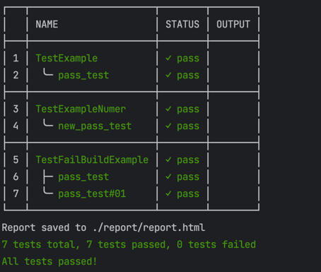

# TREP
Trep is a simple CLI tool designed to make the output of golang test commands more readable and appealing to the user.



## Installation

```shell
go install github.com/cjp2600/trep@latest
```

## `exec` Command

### Description

The `exec` command is used to execute Go tests and format their output. It provides various flags to modify its behavior, such as filtering only failed tests, generating reports, and configuring the run mode.

### Usage

```shell
./trep exec "[golang test command]"
```

#### Options

- **`-f`, `--only-fail`**: If set, only failed tests will be displayed. Default is `false`.
- **`-r`, `--report`**: If set, a report will be generated. Default is `false`.
- **`-p`, `--report-path`**: Specifies the path where the report will be saved. Default is the current directory (`./`).
- **`-m`, `--mode`**: Specifies the run mode. Available options are `'cli'`, `'ci'`. Default is `'cli'`.
- **`-n`, `--report-name`**: Allows you to provide a custom name for the report. Example: `'report'`.

### Examples

1. **Executing Tests and Displaying Only Failures**

   Execute the Go tests and display only the failed tests:

```shell
./trep exec "go test ./... -v -cover" --only-fail
```

2. **Executing Tests and Generating a Report**

   Execute the Go tests and generate a report:

```shell
./trep exec "go test ./... -v -cover" --report
```

3. Specifying a Custom Report Path and Name

Execute the Go tests and save the report in a custom directory with a custom name:

```shell
./trep exec "go test ./... -v -cover" --report --report-path ./reports --report-name report
```

4. **Running in CI Mode**

   Execute the Go tests in CI mode:

```shell
./trep exec "go test ./... -v -cover" --mode ci
```
**Notes**

Make sure that the specified report path exists, or an error may occur when trying to save the report.

